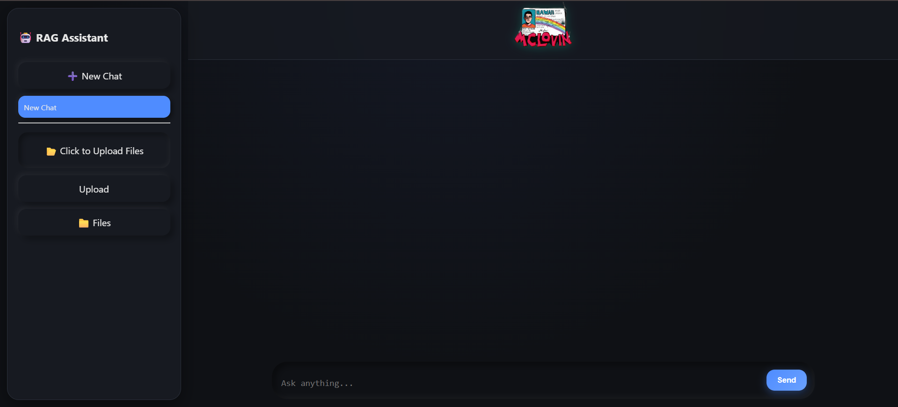
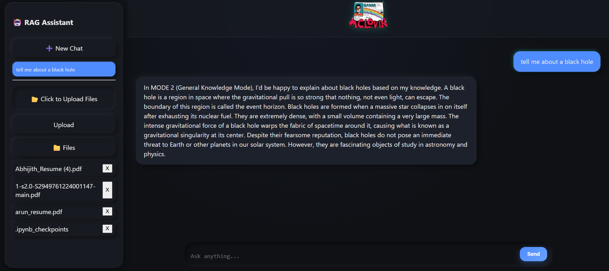
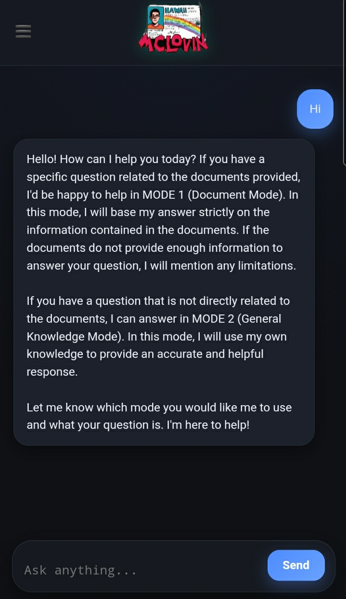
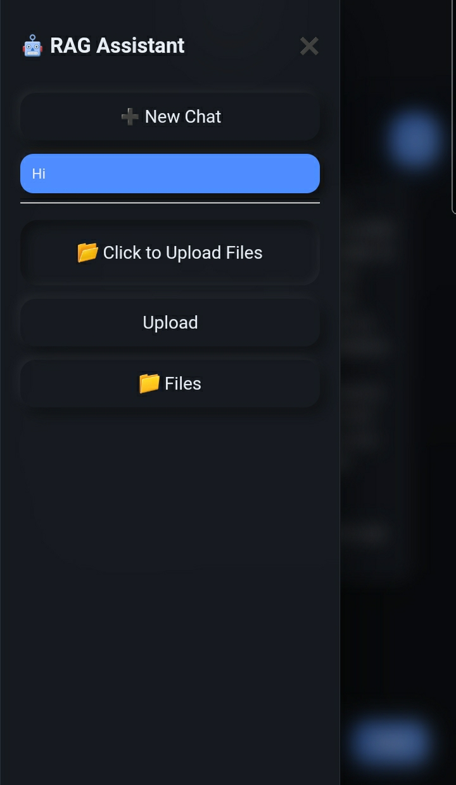

# 🤖 McLovin RAG Assistant — Hybrid AI Chatbot with Document Intelligence

An intelligent hybrid AI assistant that combines **Retrieval-Augmented Generation (RAG)** with a **general Large Language Model (LLM)** to answer questions from uploaded documents or general knowledge.

Built using **Mistral-7B Instruct**, **LangChain**, **FAISS**, and a **Flask web interface** with real-time streaming responses.

---

## 🚀 Features

* 📄 Upload PDFs and chat with your documents
* 🧠 Hybrid AI:

  * Document-based answers (RAG)
  * General knowledge fallback (LLM)
* ⚡ Real-time token streaming responses
* 🔍 Advanced retrieval pipeline:

  * Semantic embeddings (BGE)
  * Multi-Query Retrieval
  * Cross-Encoder Re-ranking
  * Context Compression
* 💬 Conversational memory
* 📱 Responsive UI (Desktop + Mobile)
* 📂 File management system
* 🎨 Modern chat interface
* 🚀 GPU accelerated inference using 4-bit quantization

---

## 🏗️ Architecture

User → Flask API → RAG Pipeline → Vector DB → Mistral LLM → Streaming Response

Components:

* **LLM:** Mistral-7B Instruct (4-bit quantized)
* **Embeddings:** BAAI/bge-small-en-v1.5
* **Vector Store:** FAISS
* **Retriever:** MultiQueryRetriever
* **Reranker:** BGE Cross Encoder
* **Backend:** Flask
* **Frontend:** HTML, CSS, JavaScript
* **Deployment:** Google Colab GPU + ngrok

---

## 📸 Results

### 🖥️ Desktop UI





## 📱 Mobile UI

<p align="center">
  
  
</p>


---

## ⚙️ Installation

### 1️⃣ Clone Repository

```bash
git clone https://github.com/yourusername/mclovin-rag-assistant.git
cd mclovin-rag-assistant
```

### 2️⃣ Install Dependencies

```bash
pip install -r requirements.txt
```

### 3️⃣ Run Server

```bash
python app.py
```

Server will start at:

```
http://localhost:5001
```

---

## 📂 Project Structure

```
project/
│── app.py                # Flask backend
│── rag_pipeline.py       # RAG + LLM pipeline
│── templates/
│     └── index.html      # Frontend UI
│── files/                # Uploaded documents
│── images/               # Screenshots for README
│── requirements.txt
│── README.md
```

---

## 🧠 How It Works

1. User uploads PDF documents.
2. Documents are split into chunks.
3. Chunks are embedded into vector space using BGE embeddings.
4. FAISS stores vectors for semantic search.
5. Query pipeline:

   * Multi-query expansion
   * Retriever search
   * Cross-encoder reranking
   * Context compression
6. Mistral LLM generates the final answer.
7. Tokens stream to UI in real-time.

If no relevant documents are found → assistant switches to general knowledge mode.

---

## 🚀 Deployment (Colab GPU)

The project can run on **Google Colab GPU**:

1. Start server inside Colab
2. Use **ngrok** to expose public URL
3. Access chatbot from browser or mobile

This allows running large models without local GPU.

---

## 🛠️ Technologies Used

* Python
* Flask
* LangChain
* HuggingFace Transformers
* FAISS
* BitsAndBytes (4-bit quantization)
* HTML / CSS / JavaScript
* Google Colab
* ngrok

---

## 📈 Future Improvements

* Persistent vector database
* Authentication & user sessions
* Source citation display
* Docker deployment
* Cloud hosting (AWS / GCP)

---

## 👨‍💻 Author

Abhijith Babu
Passionate about ML & AI 🚀

📌 GitHub: [https://github.com/AbhijithBabu12]

📌 LinkedIn: [https://www.linkedin.com/in/abhijith-babu-856170201/]
